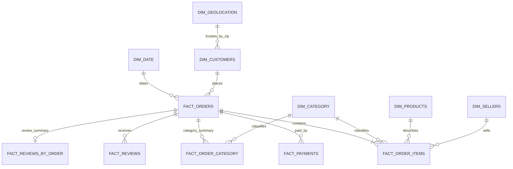

# Olist E-Commerce Business Intelligence & Customer Analytics

A portfolio-ready project analyzing real Olist Brazilian marketplace data with Python, Pandas, SQL, Power BI-ready tables, and an optional Streamlit application. It is designed around useful operational and commercial questions, with explicit fact-table grains to prevent inflated totals.

## Dataset and scope

The project uses the nine supplied Olist CSVs in `data/raw/`. The order dataset covers purchases from September 2016 through October 2018. The raw files are kept local and ignored by Git because the geolocation file is large and the dataset should be obtained from its original source by anyone cloning this repository. For privacy and licensing, share the source link and setup instructions rather than redistributing the raw files publicly.

## Data model



`dim_date` contains one row per calendar date across the order period. `fact_orders` is one row per order; `fact_order_items` one row per item line; `fact_payments` one row per payment sequence; `fact_reviews` one row per review record. Payments and reviews are not joined directly to item lines. This avoids multiplying sales when an order has multiple items, payments, or reviews. Customer `customer_unique_id` identifies repeat buyers across their order-specific `customer_id` records. Geolocation is aggregated to postal-prefix medians because its 1,000,163 source rows contain only 19,015 unique prefixes.

## Questions answered

- How do gross product revenue and order counts change by month?
- Which categories and products contribute the most product-price revenue and orders?
- Which customer states account for the most orders, customers, and revenue?
- What are the average delivery duration and late-delivery share among delivered orders with dates?
- How are review scores distributed, and how do they vary with late delivery?
- Which payment methods and installment counts appear, and what payment value is recorded?

## Definitions and assumptions

- **Product revenue** is `order_items.price`, summed at item-line grain. `freight_value` is kept separate. Payment value is analyzed independently and is not treated as product revenue.
- **Delivery days** is elapsed time from purchase timestamp to delivered-customer timestamp, in days. Only orders with both dates are eligible.
- **Late** means delivered timestamp is after the estimated-delivery timestamp, and is only defined for delivered orders with both timestamps.
- **Average review score by order** averages review records within each order first so orders with multiple review records do not receive extra weight.
- Missing delivery timestamps are retained as missing, not filled with zero. Missing product categories are labeled `Unknown`; untranslated Portuguese category names are retained as source values.
- The review file contains repeated `review_id` values on distinct order records; records are retained because they are not duplicate full rows.

## Data quality findings

The supplied files contain 99,441 orders (96,478 delivered), 112,650 order-item lines, 103,886 payment records, 99,224 review records, 99,441 customer records, 32,951 products, 3,095 sellers, 1,000,163 geolocation rows, and 71 category translations. The order table has 160 missing approval timestamps, 1,783 missing carrier timestamps, and 2,965 missing delivered timestamps. Product category/description attributes are missing for 610 products. Geolocation has repeated postal-prefix records and is not a unique-key table. Exact per-file quality counts and join checks are regenerated by the pipeline in `data/processed/`.

## Run the pipeline

Python 3.10+ is recommended.

```bash
python -m venv .venv
# Windows: .venv\Scripts\activate
# macOS/Linux: source .venv/bin/activate
pip install -r requirements.txt
python python/data_cleaning.py
```

This writes normalized analytical CSV tables, a SQLite database, and data-quality audit files under `data/processed/`. See [`data_dictionary.md`](data_dictionary.md) for the source columns and relationship notes, and [`reports/analysis_summary.md`](reports/analysis_summary.md) plus its CSVs for verified descriptive results.

Run SQL in `sql/business_analysis.sql` against `data/processed/olist_analytics.db` using SQLite. Readable queries cover monthly revenue, category and product performance, state performance, delivery, review scores, and payments.

## Power BI model and dashboard

Import the CSV tables in `data/processed/` (or connect to the SQLite database). Create one-to-many, single-direction relationships using the model above. Use `fact_order_items` for product-price revenue, `fact_orders` for order and delivery metrics, `fact_payments` for payment analysis, and `fact_reviews` for review analysis. Do not sum order-level measures from a joined item-payment-review table.

The analytical export includes `fact_order_category` (one order-category row) and `fact_reviews_by_order` (one row per order with reviews) for safe category delivery and order-weighted review reporting. The four-page design, measures, field mappings, and formatting recommendations are documented in [`powerbi/dashboard_guide.md`](powerbi/dashboard_guide.md). The guide and Power BI-ready tables are included; creating the `.pbix` file itself requires Power BI Desktop.

## Optional Streamlit dashboard

```bash
pip install -r streamlit/requirements.txt
streamlit run streamlit/app.py
```

The app reads the processed SQLite database and provides filters and interactive charts for sales, customers, delivery, satisfaction, and payments.

## Repository layout

- `data/raw/` — local source CSVs; intentionally Git-ignored
- `data/processed/` — generated analytical tables, database, and audits; Git-ignored
- `python/data_cleaning.py` — reproducible transformation pipeline
- `sql/business_analysis.sql` — business queries
- `powerbi/dashboard_guide.md` — Power BI build instructions and measures
- `streamlit/app.py` — optional interactive application
- 
otebooks/` — EDA notebook location
- `visuals/` — exported visuals / screenshots

## Limitations

This historical marketplace dataset is observational. It supports descriptive comparisons, not causal claims. State-level customer location comes from the customer table; it should not be presented as seller location. Product descriptions and delivery dates have gaps. The dataset is from 2016–2018 and should not be described as current marketplace performance.


